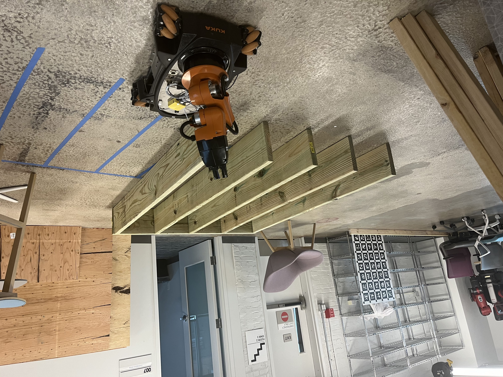

# Cavity Detection Module

## Overview

The Cavity Detection Module is a component of a robotic solution for installing blown-in insulation in an attic environment. This ROS package detects to different types of "regions of interest": horizontal cavity banks (ex. between floor joists) and vertical cavities (ex. between studs). In total the module includes 3 nodes, one for detecting each cavity type using an RGB-D camera and one node for fusing individual observations and building a map of cavities in the environment. This package runs in real time on a Raspberry Pi 4 as part of a mobile robotic system using the KUKA youBot platform. 

    
    

    Left: Horizontal Cavity,    Right: Vertical Cavity 

## Scripts

### `scripts/horizontal_roi.py`

This script initializes the ROS node `horizontal_detector_node` and publishes the detected horizontal ROIs to the `/horiz_roi` topic. This node processes depth images, searching for sets of lines parallel to the ground plane with a consistent perpendicular distance. Patterns meeting this criteria represent the tops of joists, the gaps between which are candidates for insulation. This technique utilizes the Hough line transform implementation in OpenCV.

Horizontal cavities are characterized by the following:
- Center (x, y)
- Length
- Width
- Depth
- Orientation (rad)
- Number of Cavities

    
    

### `scripts/vertical_roi.py`

This script initializes the ROS node `vertical_detector_node` and publishes the detected ROIs to the `/vert_roi` topic. Vertical cavities are detected by leveraging the design of the textile cover applied over the studs before insulation is installed. A lightweight object detection model (trained using Roboflow) identifies instances of the company logo, which form the bounding area for the region of interest. This region is then located in 3D space by referencing the depth image. RANSAC plane segmentation is used to distinguash different walls (such as in a corner), and provide the orientation that the robot can align to face the wall. 

Vertical ROIs are characterized by the following:
- Center (x, y)
- Length
- Height
- Orientation (rad)
- Number of cavities

    
    

### `scripts/cavity_map.py`

This script initializes the ROS node `cavity_map` and subscribes to the `/horiz_roi` and `/vert_roi` topics to receive horizontal and vertical ROIs, respectively. As it recieves observations from the above listed topics, it builds and updates a list of cavity regions. New observations are referenced against the list of existing ROIs 

### `scripts/ransac.py`

This script contains the implementation of the RANSAC algorithm for plane fitting. It is used by both `scripts/horizontal_roi.py` and `scripts/vertical_roi.py` to fit planes that represent either the floor or walls. This simple implementation reduces the dependency on a package like PCL or Open3D, which struggle on Raspberry Pi. 

## Messages

### `Roi.msg`

Defines the structure of a Region of Interest (ROI) message, including fields for the center, orientation, dimensions, and type of the ROI.

## Launch Files

### `launch/roi.launch`

Launches the `vertical_roi`, `horizontal_roi`, and `cavity_map` nodes for detecting and mapping cavities.

## Dependencies

- ROS
- NumPy
- OpenCV
- tf
- tf2_ros
- cv_bridge
- visualization_msgs
- geometry_msgs
- sensor_msgs
- std_msgs